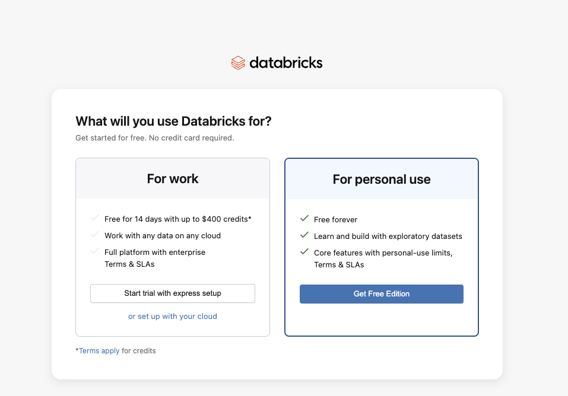
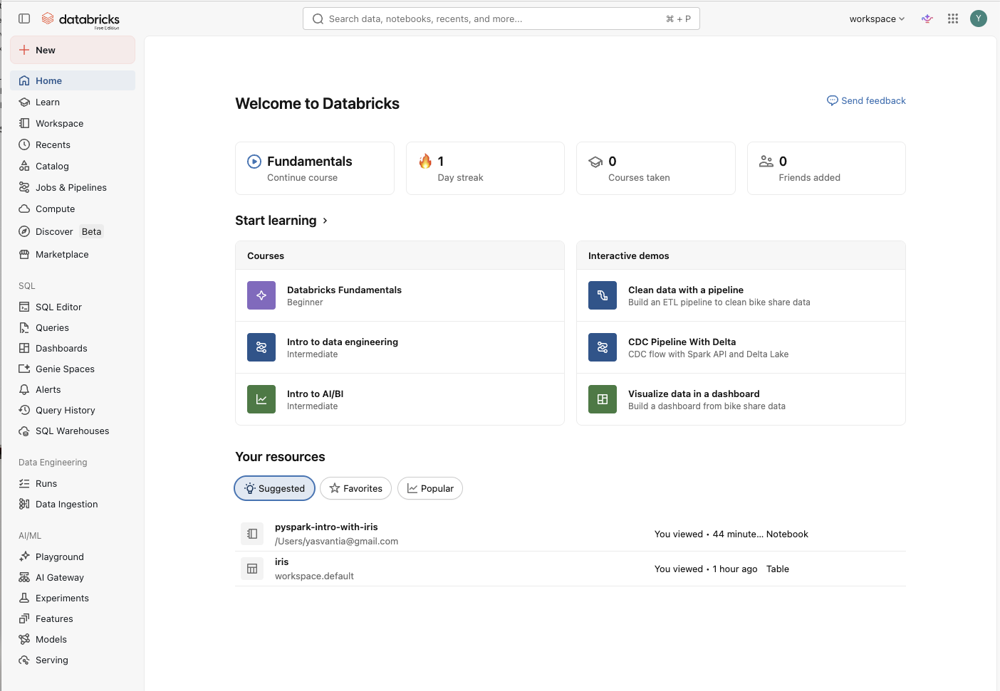
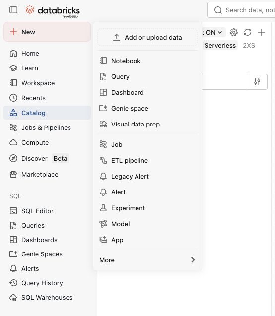
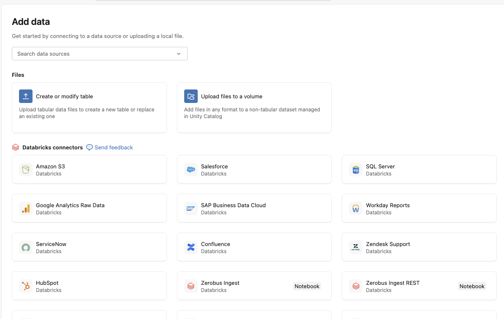
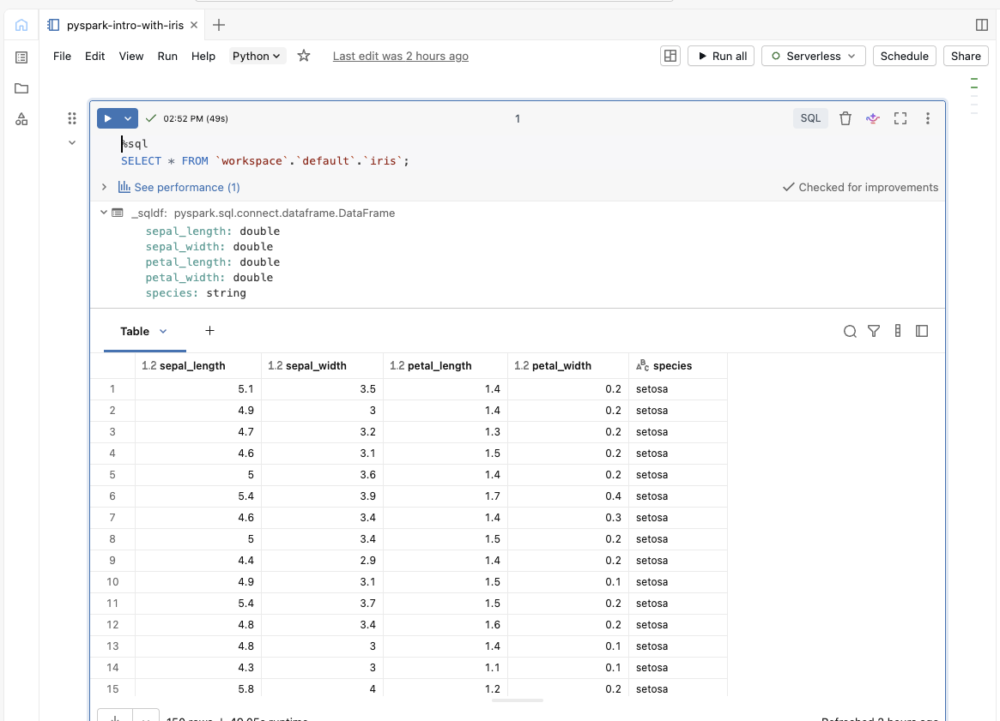

# DataBricks and PySpark — Research Notes
---

## Table of Contents

1. [What is Big Data?](#1-what-is-big-data)
2. [OLTP — Online Transaction Processing](#2-oltp--online-transaction-processing)
3. [ACID Properties](#3-acid-properties)
4. [OLAP — Online Analytical Processing](#4-olap--online-analytical-processing)
5. [Data Warehouses](#5-data-warehouses)
6. [Data Lakes](#6-data-lakes)
7. [Data Lakehouses](#7-data-lakehouses)
8. [Delta Lakes](#8-delta-lakes)
9. [Apache Spark](#9-apache-spark)
10. [PySpark](#10-pyspark)
11. [Databricks](#11-databricks)
12. [Getting Started with Databricks](#12-getting-started-with-databricks)

---

## 1. What is Big Data?

"Big Data" refers to datasets that are so large, so fast-moving, or so varied in structure that traditional tools (like a standard SQL database or even Excel) simply can't handle them efficiently.

The classic framework for defining Big Data is the **3 Vs**:

| V | Description | Example |
|---|-------------|---------|
| **Volume** | The sheer size of the data | Spotify storing hundreds of millions of listening events per day |
| **Velocity** | How fast the data is generated or needs to be processed | Live feed of tweets during a major event like the Oscars |
| **Variety** | Different formats — structured, semi-structured, unstructured | A mix of CSV sales records, JSON API responses, and MP4 video files |

Some definitions extend this to the **5 Vs**, adding:

- **Veracity** — how trustworthy or accurate the data is (e.g. user-submitted data often has typos, duplicates, or missing fields)
- **Value** — the actual business or analytical insight you can extract from the data

### A Practical Example

Imagine I'm running an online bookstore. When the shop is small, a simple MySQL database on a single server is fine. But once the shop has millions of customers browsing, purchasing, leaving reviews, and receiving recommendations in real time — all while I'm also pulling in social media data, clickstream logs, and supplier inventory feeds —  Big Data tools and architectures become necessary.

---

## 2. OLTP — Online Transaction Processing

**OLTP** stands for *Online Transaction Processing*. It's the style of database system designed to handle lots of small, fast, frequent operations — things like recording a purchase, updating a stock count, or processing a login.

### Key Characteristics

- **High throughput of short transactions** — thousands of reads and writes per second
- **Optimised for current data** — you mostly care about the latest state of records
- **Row-oriented storage** — data is stored and retrieved row by row
- **Highly normalised schema** — data is split across many related tables to reduce redundancy

### Example continued

When a customer buys a book on my website, several things happen almost simultaneously:

1. A new row is inserted into the `orders` table
2. The `inventory` table is updated to reduce stock
3. A row is inserted into the `payments` table
4. A confirmation email record is added to the `notifications` table

Each of these is a small, atomic operation. OLTP systems are built to handle exactly this kind of rapid, concurrent transactional workload.

### Common OLTP Databases

- PostgreSQL
- MySQL
- Oracle Database
- Microsoft SQL Server

---

## 3. ACID Properties

ACID is a set of properties that guarantee database transactions are processed reliably. This is especially important in OLTP systems where data integrity is critical.

| Property | Meaning | Example |
|----------|---------|---------|
| **Atomicity** | A transaction is all-or-nothing | If my payment goes through but the order insert fails, neither change should be saved |
| **Consistency** | A transaction brings the database from one valid state to another | Stock count should never go negative after a sale |
| **Isolation** | Concurrent transactions don't interfere with each other | Two customers buying the last copy of a book simultaneously shouldn't both succeed |
| **Durability** | Once committed, data persists even if the system crashes | My confirmed order shouldn't disappear if the server restarts immediately after |

ACID compliance is what makes relational databases trustworthy for financial, medical, and e-commerce applications — anywhere where "losing" a transaction is unacceptable.

---

## 4. OLAP — Online Analytical Processing

**OLAP** stands for *Online Analytical Processing*. It's the opposite end of the spectrum from OLTP. Rather than handling lots of tiny transactions, OLAP systems are designed for complex queries over large volumes of historical data — the kind of queries that business analysts and data scientists run to understand trends and patterns.

### Key Characteristics

- **Complex, long-running queries** — aggregations across millions or billions of rows
- **Read-heavy workloads** — data is mostly queried, rarely updated
- **Column-oriented storage** — data is stored column by column, making aggregations much faster
- **Denormalised schema** — data is often consolidated into wider tables (fewer joins needed)

### Example

Rather than asking *"what did customer #12345 buy?"* (an OLTP query), an OLAP query might ask:

> *"What were the total sales by genre, broken down by month, for the last three years?"*

This query might scan tens of millions of rows. A traditional OLTP database would struggle with this; an OLAP system is purpose-built for it.

### OLTP vs OLAP — Quick Comparison

| Feature | OLTP | OLAP |
|---------|------|------|
| Purpose | Day-to-day transactions | Analysis and reporting |
| Query type | Simple, fast | Complex, slow |
| Data volume | GB range | TB–PB range |
| Users | App users, customers | Analysts, data scientists |
| Update frequency | Continuous | Periodic (batch loads) |

---

## 5. Data Warehouses

### What Are They?

A **Data Warehouse** is a centralised repository designed specifically for analytical (OLAP) workloads. Instead of running heavy analytical queries directly on the production OLTP database (which would slow down the live application), data is extracted from operational systems, transformed into a consistent format, and loaded into the warehouse — a process known as **ETL** (Extract, Transform, Load).

The warehouse becomes the "single source of truth" for business intelligence and reporting.

### How Do They Work?

The typical flow looks like this:

```
[Source Systems]          [ETL Pipeline]         [Data Warehouse]        [Consumption]
 - Sales DB         -->   Extract, clean,    -->  Centralised,       -->  BI dashboards
 - Marketing APIs         transform &             structured,             Reports
 - CRM system             load                    historical data         Ad-hoc queries
 - Website logs
```

1. **Extract** — data is pulled from multiple source systems (databases, APIs, flat files)
2. **Transform** — data is cleaned, standardised, deduplicated, and restructured
3. **Load** — the processed data is loaded into the warehouse

Inside the warehouse, data is often organised into a **star schema** or **snowflake schema** — with a central "fact" table (e.g. sales transactions) surrounded by "dimension" tables (e.g. customers, products, dates).

### Schema Example (Star Schema)

```
              [dim_customer]
                    |
[dim_date] -- [fact_sales] -- [dim_product]
                    |
              [dim_store]
```

### Popular Data Warehouses

- **Amazon Redshift**
- **Google BigQuery**
- **Snowflake**
- **Azure Synapse Analytics**

### Limitations of Data Warehouses

- They work best with **structured data** only (tables, rows, columns)
- Storage is relatively expensive
- Schema must be defined before data is loaded ("schema-on-write")
- Not well-suited to machine learning workloads that need raw, unprocessed data

---

## 6. Data Lakes

### What Are They?

A **Data Lake** is a large, centralised storage repository that holds raw data in its native format — structured, semi-structured, or completely unstructured. Unlike a warehouse, the data isn't transformed before it goes in. You just dump everything in and figure out the schema when you need to query it ("schema-on-read").

The idea is: *store everything now, figure out how to use it later.*

### How Do They Work?

```
[Any Data Source]       [Data Lake]              [Consumption]
 - CSV files       -->  Raw storage          -->  Data scientists (ML)
 - JSON APIs            (S3, ADLS, GCS)           Data engineers (ETL)
 - Images                                          Analysts (ad-hoc)
 - Audio files          No transformation
 - Sensor data          required on ingest
 - Server logs
```

Data lakes are typically built on cheap, scalable **object storage** (like AWS S3 or Azure Data Lake Storage). The data sits in its original format until something actually needs to read it.

### Advantages Over Warehouses

- Can store **any data type** — images, audio, PDFs, logs, JSON, Parquet, CSV
- Very **cheap storage** compared to warehouses
- Flexible — data scientists can access raw data directly for ML experiments
- No need to define a schema upfront

### The Problem: "Data Swamps"

Data lakes have a notorious reputation for becoming **data swamps** — enormous piles of poorly organised, undocumented, inconsistent data where no one really knows what's in there or whether it can be trusted. Without proper governance, metadata management, and quality controls, a data lake quickly becomes more of a liability than an asset.

---

## 7. Data Lakehouses

### What Are They?

A **Data Lakehouse** is an architecture that tries to combine the best of both worlds — the low-cost, flexible storage of a data lake with the data management features (transactions, schema enforcement, versioning) of a data warehouse.

Think of it as: *a data lake that actually behaves like a warehouse where you need it to.*

### How It Differs

| Feature | Data Warehouse | Data Lake | Data Lakehouse |
|---------|----------------|-----------|----------------|
| Storage cost | High | Low | Low |
| Supports unstructured data | No | Yes | Yes |
| ACID transactions | Yes | No | Yes |
| Schema enforcement | Yes | No | Optional |
| BI & reporting | Excellent | Poor | Good |
| ML workloads | Poor | Good | Good |

The lakehouse architecture achieves this by adding a **metadata and transaction layer** on top of the raw object storage — the most popular implementation of this being **Delta Lake** (see below).

### Key Implementations

- **Delta Lake** (open source, used heavily in Databricks)
- **Apache Iceberg**
- **Apache Hudi**

---

## 8. Delta Lakes

### What Is It?

**Delta Lake** is an open-source storage layer that brings ACID transactions, schema enforcement, and versioning to data lakes. It was originally developed by Databricks and later open-sourced.

It sits on top of your existing object storage (S3, ADLS, GCS) and adds a **transaction log** — a record of every change ever made to a dataset.

### Key Features

| Feature | What It Means in Practice |
|---------|--------------------------|
| **ACID Transactions** | Multiple writers can safely modify a table simultaneously without corrupting data |
| **Schema Enforcement** | New data that doesn't match the expected schema is rejected (prevents garbage getting in) |
| **Schema Evolution** | You can safely add or rename columns over time |
| **Time Travel** | You can query a table *as it looked at any previous point in time* |
| **Upserts (MERGE)** | You can insert-or-update rows efficiently — great for CDC (Change Data Capture) |
| **Unified batch + streaming** | The same Delta table can receive both batch loads and streaming data |

### Time Travel Example

```python
# Query the table as it looked 7 days ago
df = spark.read.format("delta") \
    .option("timestampAsOf", "2024-01-01") \
    .load("/delta/my_table")
```

This is incredibly useful for debugging pipelines, auditing, and rolling back mistakes.

---

## 9. Apache Spark

### What Problem Did It Solve?

Before Spark, the dominant framework for processing Big Data was **Hadoop MapReduce** (released around 2006). MapReduce was revolutionary — it allowed you to distribute a computation across hundreds or thousands of cheap machines. But it had a major flaw: **after every step of a computation, results were written to disk**. For iterative algorithms (like machine learning model training, which might need to loop over data hundreds of times), this made things painfully slow.

Apache Spark, first released by UC Berkeley's AMPLab in 2012, solved this by **keeping data in memory (RAM) as much as possible** during computation. Instead of writing intermediate results to disk after every step, Spark chains operations together and executes them in memory — which can be **10–100x faster** than MapReduce for many workloads.

### How Does It Work? — The Architecture

Spark follows a **master-worker architecture** (also called driver-executor):

```
                    ┌─────────────────────────┐
                    │       Driver Program    │
                    │  (your PySpark script)  │
                    │                         │
                    │  SparkContext / Session │
                    └────────────┬────────────┘
                                 │
                    ┌────────────▼─────────────┐
                    │      Cluster Manager     │
                    │ (YARN / Kubernetes /     │
                    │  Spark Standalone)       │
                    └────┬──────────┬──────────┘
                         │          │
              ┌──────────▼──┐   ┌───▼──────────┐
              │  Executor 1 │   │  Executor 2  │  ...
              │  (Worker)   │   │  (Worker)    │
              │  Tasks      │   │  Tasks       │
              └─────────────┘   └──────────────┘
```

- **Driver** — the central coordinator. This is where your code runs. It translates your high-level instructions into a plan and schedules work across the cluster.
- **Cluster Manager** — allocates resources (CPU, memory) to Spark jobs. Can be YARN (Hadoop), Kubernetes, or Spark's built-in standalone manager.
- **Executors** — the workers. Each executor runs on a separate node in the cluster, executing the actual tasks and holding data partitions in memory.

### Core Concepts

**RDDs (Resilient Distributed Datasets)**
The fundamental data structure in Spark. An RDD is an immutable, distributed collection of objects split across many nodes. If a partition is lost (a node crashes), Spark can recompute it from the original source thanks to its lineage graph.

**DataFrames and Datasets**
In modern Spark (2.0+), most people work with **DataFrames** — a higher-level abstraction that looks and behaves a lot like a pandas DataFrame or a SQL table. They're much easier to work with and Spark can optimise them more aggressively.

**Lazy Evaluation**
When you write a transformation in Spark (e.g. `filter`, `groupBy`, `join`), Spark doesn't execute it immediately. It builds up a **DAG (Directed Acyclic Graph)** of operations and only actually runs them when you call an *action* (like `.collect()`, `.count()`, or `.write()`). This allows Spark to optimise the entire plan before running anything.

```
Transformations (lazy):   filter() → groupBy() → agg()
                                                      ↓
Actions (triggers execution):                      .show()
```

**Catalyst Optimizer**
Spark's built-in query optimiser. It takes your DataFrame operations and SQL queries, rewrites them into a more efficient execution plan, and then generates optimised bytecode to run.

### Spark's Core Libraries

| Library | Purpose |
|---------|---------|
| **Spark SQL** | Querying structured data with SQL |
| **Spark Streaming / Structured Streaming** | Real-time stream processing |
| **MLlib** | Distributed machine learning |
| **GraphX** | Graph computation |

### Why Did It Become Popular?

1. **Speed** — in-memory processing made it dramatically faster than Hadoop MapReduce
2. **Ease of use** — high-level APIs in Python, Scala, Java, and R made it accessible
3. **Versatility** — one tool for batch processing, streaming, ML, and SQL
4. **Open source** — free to use, massive community, runs on existing Hadoop infrastructure
5. **Fault tolerance** — it handles node failures gracefully without losing work

---

## 10. PySpark

### What Is It?

**PySpark** is the Python API for Apache Spark. It lets you write Spark jobs in Python rather than Scala (Spark's native language).

### Why Do We Tend to Use PySpark?

Most data scientists and analysts already know Python. The data ecosystem in Python (pandas, NumPy, scikit-learn, matplotlib) is enormous, and PySpark sits comfortably alongside all of it.

While Scala is more performant (since Spark itself is written in Scala), the difference is often negligible for most workloads, and the productivity gains from writing in a familiar language are significant.

```python
# A simple PySpark example: counting popular book genres
from pyspark.sql import SparkSession
from pyspark.sql.functions import col, count

spark = SparkSession.builder.appName("BookstoreAnalysis").getOrCreate()

df = spark.read.csv("/data/sales.csv", header=True, inferSchema=True)

genre_counts = df.groupBy("genre") \
                 .agg(count("*").alias("total_sales")) \
                 .orderBy(col("total_sales").desc())

genre_counts.show(10)
```

This looks very similar to pandas — but under the hood, this is running as a distributed computation across a cluster.

---

## 11. Databricks

### What Is It?

**Databricks** is a unified data analytics platform founded in 2013 by the original creators of Apache Spark. It provides a managed, cloud-based environment for running Spark workloads without having to configure and manage the underlying infrastructure yourself.

It runs on top of the major cloud providers (AWS, Azure, Google Cloud) and has become one of the most widely adopted platforms for data engineering, data science, and machine learning.

### What Problems Did It Solve?

Setting up and managing an Apache Spark cluster yourself is genuinely painful. You have to:
- Provision and configure cloud VMs
- Install and tune Spark
- Set up networking and security
- Monitor cluster health
- Handle upgrades and patches
- Manage storage integrations

Databricks abstracts all of this away. You just open a browser, spin up a cluster with a few clicks, and start writing code. The infrastructure is managed for you.

Beyond infrastructure, Databricks also addressed the fragmentation problem: data teams were typically using separate tools for data engineering (Spark), SQL analytics (a warehouse), and ML (Python notebooks + MLflow). Databricks brought all of these into a single platform.

### How Does It Work?

Databricks runs on top of your cloud account. When you create a **cluster** in Databricks, it's provisioning actual cloud VMs (EC2 instances on AWS, for example) and configuring Spark on them automatically.

```
┌─────────────────────────────────────────────────────┐
│                 Databricks Platform                 │
│                                                     │
│  ┌────────────┐  ┌────────────┐  ┌───────────────┐  │
│  │  Notebooks │  │  Workflows │  │  SQL Warehouse│  │
│  │  (Python,  │  │  (Jobs /   │  │  (Analytics)  │  │
│  │  SQL, R)   │  │  Pipelines)│  │               │  │
│  └─────┬──────┘  └────┬───────┘  └──────┬────────┘  │
│        └──────────────┴─────────────────┘           │
│                       │                             │
│              ┌────────▼────────┐                    │
│              │  Spark Cluster  │                    │
│              │  (managed VMs)  │                    │
│              └────────┬────────┘                    │
│                       │                             │
│              ┌────────▼────────┐                    │
│              │   Delta Lake    │                    │
│              │  (on cloud      │                    │
│              │   storage)      │                    │
│              └─────────────────┘                    │
└─────────────────────────────────────────────────────┘
```

### Why Has It Become Popular?

1. **Managed infrastructure** — no more cluster setup headaches
2. **Collaborative notebooks** — multiple team members can work in the same notebook simultaneously (like Google Docs but for code)
3. **Delta Lake integration** — first-class support for Delta tables built in
4. **Unity Catalog** — centralised data governance across all clouds and workloads
5. **MLflow integration** — experiment tracking and model deployment built in
6. **Cost optimisation** — features like auto-scaling and spot instance management keep costs down
7. **Photon engine** — a Databricks-built query engine written in C++ that can dramatically accelerate SQL and DataFrame workloads

### Key Features

| Feature | Description |
|---------|-------------|
| **Notebooks** | Interactive, collaborative coding environment supporting Python, SQL, Scala, and R |
| **Clusters** | Managed Spark clusters — spin up and down with a few clicks |
| **Delta Live Tables (DLT)** | Declarative pipeline framework for building reliable ETL with automatic data quality checks |
| **Unity Catalog** | Centralised governance — manage permissions, lineage, and metadata across all your data assets |
| **MLflow** | Open-source ML lifecycle management — experiment tracking, model registry, deployment |
| **Databricks SQL** | A serverless SQL warehouse for running analytics queries without needing a full Spark cluster |
| **Workflows** | Job scheduler for orchestrating notebooks, Delta Live Tables pipelines, and dbt models |
| **Repos** | Git integration — connect your notebooks to GitHub, GitLab, or Bitbucket |
| **Auto Loader** | Incrementally and efficiently ingests new data files from cloud storage as they arrive |

---

## 12. Getting Started with Databricks

### Signing Up

1. Go to [https://www.databricks.com](https://www.databricks.com)
2. Click **"Get Started for Free"** — this takes you to the Community Edition (great for learning, no credit card needed) or you can start a free trial on your preferred cloud (AWS / Azure / GCP)
3. Choose **Community Edition** if you're just experimenting — it gives you a small cluster for free




4. Fill in your name, email, and create a password
5. Verify your email address
6. You'll land on the Databricks workspace home page



---

### Ingesting Data

#### Downloading the Dataset

1. Go to [https://www.kaggle.com/datasets/saurabh00007/iriscsv](https://www.kaggle.com/datasets/saurabh00007/iriscsv)
2. Click the **Download** button and save `Iris.csv` to your machin

#### Uploading to Databricks

1. In the left sidebar, click **" + New "**
2. In the top left of the Catalog panel, click **"Add or upload data"**



3. A menu will appear — select **"Create or modfy table"** 


4. Drag and drop your `Iris.csv` file, or click to browse for it on your machine

5. Databricks will show a preview of the data and confirm the file path — it will be stored in `/FileStore/tables/Iris.csv`

6. Click **"Create table"** or **"Done"** to finish the upload

#### Reading the Data in a Notebook

Once uploaded, head to your notebook and run the following:

```
%sql
SELECT * FROM `workspace`.`default`.`iris`;
```



---