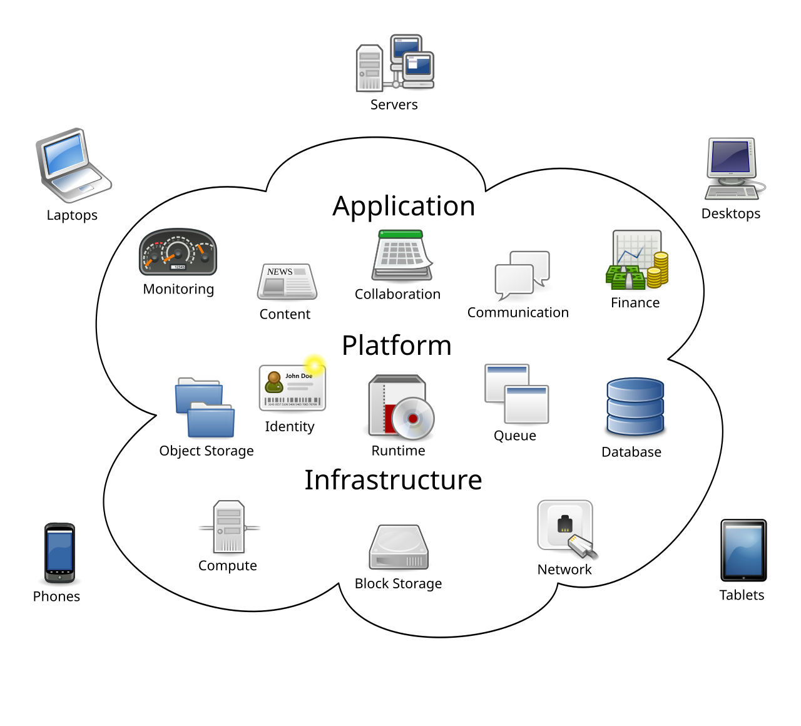
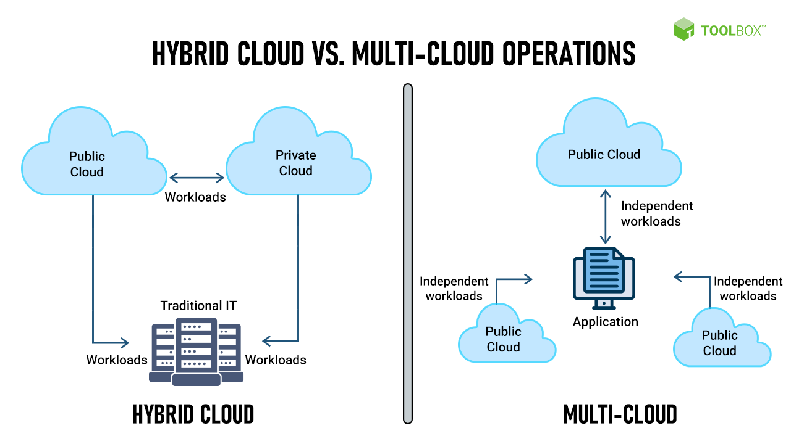
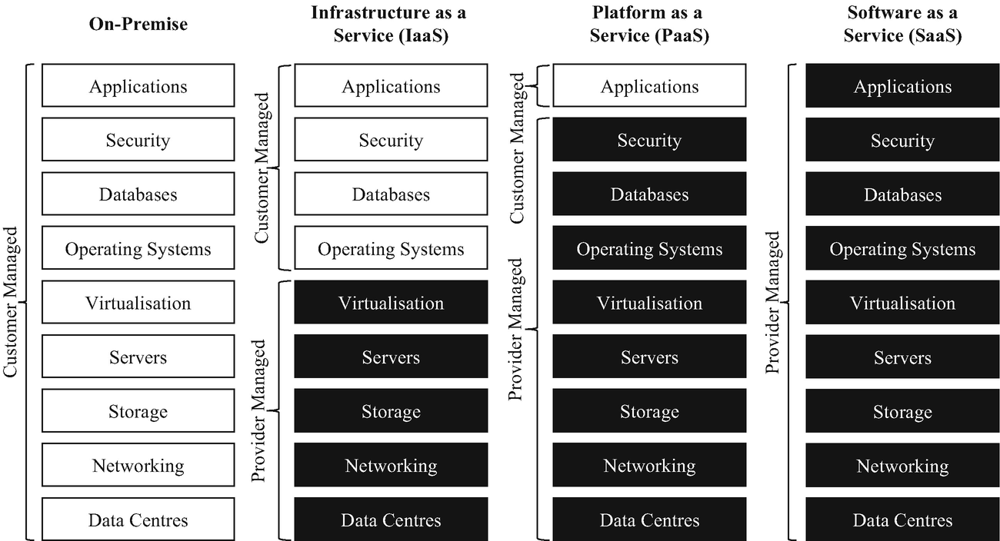

# Cloud Computing

> A comprehensive introduction to cloud computing, covering core concepts, deployment models, service types, major providers, and career certifications for data professionals.

---

## Table of Contents

1. [What is Cloud Computing?](#what-is-cloud-computing)
2. [What are Data Centres?](#what-are-data-centres)
3. [How Do You Know if Something is Running in the Cloud?](#how-do-you-know-if-something-is-running-in-the-cloud)
4. [Cloud Deployment Models](#cloud-deployment-models)
5. [Types of Cloud Services](#types-of-cloud-services)
6. [Advantages of Cloud Computing](#advantages-of-cloud-computing)
7. [Disadvantages and Pitfalls](#disadvantages-and-pitfalls)
8. [Cloud Market Share in 2026](#cloud-market-share-in-2026)
9. [The Big 3 Cloud Providers](#the-big-3-cloud-providers)
10. [What Do You Pay for in the Cloud?](#what-do-you-pay-for-in-the-cloud)
11. [Cloud Data Services](#cloud-data-services)
12. [Cloud Certifications for Data Professionals](#cloud-certifications-for-data-professionals)
13. [Conclusion](#conclusion)

---

## What is Cloud Computing?

Cloud computing is the delivery of computing services (including servers, storage, databases, networking, software, analytics, and artificial intelligence) **over the internet ("the cloud")** on a pay-as-you-go basis.

Rather than owning and maintaining physical hardware in your own building, you rent access to computing resources from a cloud provider. This shifts the responsibility of infrastructure management away from the individual organisation and onto the provider.

*Cloud computing connects users and organisations to remote servers via the internet.*

### Key Characteristics of Cloud Computing

- **On-demand self-service,** meaning resources can be provisioned instantly without human interaction from the provider
- **Broad network access,** making services accessible from anywhere via the internet
- **Resource pooling,** where providers serve multiple customers from shared infrastructure
- **Rapid elasticity,** allowing resources to scale up or down quickly based on demand
- **Measured service,** so you pay only for what you use, much like a utility bill

---

## What are Data Centres?

A **data centre** is a physical facility that houses the computer systems, servers, networking equipment, and storage infrastructure that power cloud computing. Data centres are the physical backbone behind every cloud service you use.

### Key Components of a Data Centre

- **Servers,** the physical machines running compute workloads
- **Storage systems,** comprising hard drives and SSDs holding vast amounts of data
- **Networking equipment,** including routers, switches, and fibre optic cables
- **Cooling systems,** which keep hardware from overheating and represent a major operational cost
- **Power systems,** including redundant power supplies and UPS (Uninterruptible Power Supply) units
- **Physical security,** such as biometric access controls, 24/7 security guards, and CCTV

### Scale of Cloud Data Centres

Major providers like AWS, Azure, and Google operate **"hyperscale" data centres,** facilities covering hundreds of thousands of square feet and containing hundreds of thousands of servers. AWS alone operates over **100 data centres** globally across multiple **Availability Zones** and **Regions**.

### Real-World Data Centre Walkthrough

This video shows an inside look at a Google data centre:

> [**Google Data Centre Tour on YouTube**](https://www.youtube.com/watch?v=XZmGGAbHqa0)

---

## How Do You Know if Something is Running in the Cloud?

Not all software is cloud-based. Here are the key indicators that a service or application is running in the cloud:

### Signs it IS running in the cloud

- **Accessible from any device or location** via a web browser or app, with no local installation required
- **Scales automatically,** handling millions of users simultaneously without crashing
- **Subscription or usage-based pricing,** meaning you pay monthly or annually rather than a one-time licence fee
- **Automatic updates,** where the software updates itself without user action
- **Data stored remotely,** so your files and data persist even if you change device
- **High availability,** rarely going down, with SLA (Service Level Agreement) guarantees such as 99.99% uptime
- **Hosted at a provider domain,** for example `app.aws.com` or `portal.azure.com`, or a custom domain backed by cloud infrastructure

### Signs it is NOT running in the cloud

- Software is installed locally on your machine, for example a desktop application
- Data is stored only on your local hard drive
- It requires a physical server in your office to function
- It stops working when you lose internet access

### Examples

| Cloud-Based | Not Cloud-Based |
|---|---|
| Google Docs | Microsoft Word (desktop) |
| Netflix | A DVD |
| Spotify | iTunes local library |
| GitHub | A USB stick with code |
| Snowflake | A local PostgreSQL install |

---

## Cloud Deployment Models

### The 2 Main Deployment Models

#### 1. Public Cloud

Resources are owned and operated by a third-party cloud provider and shared across multiple organisations, a setup known as multi-tenancy. This is the most common model.

- **Examples:** AWS, Microsoft Azure, Google Cloud
- **Best for:** Startups, web applications, and scalable services
- **Pros:** Low upfront cost, massive scale, no maintenance burden
- **Cons:** Less control, potential data residency concerns

#### 2. Private Cloud

Cloud infrastructure is used exclusively by a single organisation, either hosted on-premise or by a third party. The organisation retains full control over the environment.

- **Examples:** An organisation's own data centre running VMware or OpenStack
- **Best for:** Banks, governments, and healthcare organisations with strict compliance requirements
- **Pros:** Full control, greater security and privacy
- **Cons:** High cost, requires in-house expertise to manage

---

### The 2 More Complex Deployment Models

#### 3. Hybrid Cloud

A combination of public and private cloud environments, allowing data and applications to move between them. This is the most common enterprise setup.

- **Example:** A bank stores sensitive customer data in its private cloud, but runs its customer-facing web application on AWS
- **Best for:** Enterprises that need flexibility and compliance simultaneously
- **Pros:** Balance of control and scalability
- **Cons:** Complex to manage, requires strong networking setup

#### 4. Multi-Cloud

Using services from **multiple public cloud providers** simultaneously, for example using AWS for compute, Azure for Active Directory, and GCP for data analytics.

- **Example:** A company runs its ML workloads on Google Cloud for its superior AI tools, while hosting its main application on AWS
- **Best for:** Large enterprises wanting to avoid vendor lock-in
- **Pros:** Best-of-breed services, resilience, and no single point of failure
- **Cons:** Increased complexity, requires expertise across multiple platforms
- **Stat:** **87% of enterprises run multi-cloud strategies** (Flexera.com, 2026)

---

## Types of Cloud Services

There are three primary cloud service models, sometimes illustrated using a "pizza as a service" analogy, showing what the provider manages versus what the customer manages.

### 1. IaaS: Infrastructure as a Service

The provider manages the underlying physical infrastructure (servers, networking, storage) and you manage the operating system, middleware, and applications.

- **Examples:** AWS EC2, Azure Virtual Machines, Google Compute Engine
- **Best for:** IT teams that need full control but do not want to manage physical hardware
- **You manage:** OS, runtime, applications, data
- **Provider manages:** Virtualisation, servers, storage, networking

### 2. PaaS: Platform as a Service

The provider manages the infrastructure and the operating system or runtime. You focus purely on building and deploying applications.

- **Examples:** AWS Elastic Beanstalk, Azure App Service, Google App Engine, Heroku
- **Best for:** Developers who want to deploy applications without managing infrastructure
- **You manage:** Applications and data
- **Provider manages:** OS, runtime, middleware, servers, storage, networking

### 3. SaaS: Software as a Service

The provider manages everything and you simply use the software through a browser or app.

- **Examples:** Gmail, Salesforce, Slack, Snowflake, Microsoft 365, Dropbox
- **Best for:** End users and businesses that want ready-to-use software
- **You manage:** Your data and user settings only
- **Provider manages:** Everything else

| | IaaS | PaaS | SaaS |
|---|---|---|---|
| **Control** | High | Medium | Low |
| **Responsibility** | High | Medium | Low |
| **Flexibility** | High | Medium | Low |
| **Ease of use** | Lower | Medium | High |
| **Example** | AWS EC2 | Heroku | Gmail |

---

## Advantages of Cloud Computing

Cloud computing offers transformative benefits for businesses of all sizes:

### Cost Savings
- No capital expenditure, meaning no need to buy and maintain expensive physical servers
- Pay-as-you-go model so you only pay for what you use
- Reduced IT staffing costs as the provider manages infrastructure

### Scalability and Flexibility
- Scale resources instantly, increasing or decreasing capacity within minutes to match demand
- Global reach, allowing deployment to any region in the world in seconds
- Elastic workloads to handle traffic spikes such as Black Friday without pre-buying hardware

### Reliability and Availability
- High uptime SLAs, with providers offering 99.9% to 99.999% availability guarantees
- Built-in redundancy, with data automatically replicated across multiple locations
- Automated backups and failover for disaster recovery

### Speed and Agility
- Faster time to market, with new environments deployable in minutes rather than weeks
- Instant access to cutting-edge AI, ML, and data tools
- Global infrastructure to deploy closer to users and reduce latency

### Sustainability
- Cloud providers invest heavily in renewable energy and energy-efficient data centres, often making cloud-hosted workloads greener than equivalent on-premise infrastructure

---

## Disadvantages and Pitfalls

Despite its benefits, cloud computing comes with real risks that businesses must manage carefully:

### Security and Privacy Concerns
- Storing sensitive data with a third party introduces risk
- Data breaches at the provider level can expose customer data
- Shared infrastructure in the public cloud may create vulnerabilities

### Cost Unpredictability
- Pay-as-you-go can lead to bill shock if resources are not properly monitored
- Complex pricing models make it hard to forecast costs accurately
- Egress (outbound data transfer) fees can be surprisingly expensive

### Vendor Lock-In
- Migrating from one cloud provider to another is complex and costly
- Proprietary services such as AWS Lambda or Azure Cosmos DB make portability difficult
- Long-term contracts or reserved instance pricing can reduce flexibility

### Internet Dependency
- Cloud services require a stable internet connection
- Outages at the provider level can make services completely unavailable
- A notable example is the 2021 AWS us-east-1 outage, which took down major websites globally

### Compliance and Regulatory Risk
- Data residency laws such as GDPR in the EU require data to stay within certain geographies
- Not all providers offer compliant configurations by default
- Industries like finance and healthcare face strict regulatory requirements

### Reduced Control
- You cannot access the physical hardware
- Provider maintenance windows and service changes are outside your control

---

## Cloud Market Share in 2026

The global cloud computing market is valued at approximately **$917.9 billion in 2026** and is projected to surpass **$1 trillion** before year-end (quantumrun.com, 2026), driven primarily by AI workloads and enterprise digital transformation.

### Market Share Breakdown (Q1 2026)

| Provider | Market Share | Annual Revenue (est.) |
|---|---|---|
| **Amazon Web Services (AWS)** | ~30% | ~$130 billion |
| **Microsoft Azure** | ~25% | ~$91 billion |
| **Google Cloud Platform (GCP)** | ~13% | ~$47 billion |
| **Others** (Oracle, IBM, Alibaba, etc.) | ~32% | N/A |

> Source: Synergy Research Group, Q1 2026

### Key Trends

- The Big Three together control approximately **68% of global cloud infrastructure**
- **94% of enterprises** now use cloud services in some form
- **87% of enterprises** operate multi-cloud strategies

---

## The Big 3 Cloud Providers

### Amazon Web Services (AWS)

AWS launched in 2006 and remains the market leader with the broadest and deepest set of cloud services.

**Known for:** The widest catalogue of services (200+), dominant in startups, scale-ups, and tech companies, and the most job postings requiring AWS experience.

**Key USPs:**
- **Breadth,** spanning compute and storage through to IoT, quantum computing, and blockchain
- **Ecosystem,** with the largest marketplace of third-party integrations
- **AI and ML,** through Amazon Bedrock which supports Anthropic Claude, Meta LLaMA, and Amazon Nova
- **Global reach,** with the largest global infrastructure footprint
- **Maturity,** being the most battle-tested provider with the most documentation and community support

**Flagship data services:** S3, Redshift, Glue, Athena, EMR, Kinesis, SageMaker

---

### Microsoft Azure

Azure launched in 2010 and has grown rapidly through enterprise adoption, now the second largest provider.

**Known for:** Dominance in enterprise and corporate environments, and deep integration with Microsoft's existing product suite.

**Key USPs:**
- **Microsoft ecosystem integration,** providing seamless connectivity with Office 365, Teams, Active Directory, GitHub, and Dynamics 365
- **Hybrid cloud leadership,** via Azure Arc and Azure Stack for on-premise/cloud hybrid setups
- **Enterprise trust,** being the preferred choice of governments, banks, and large corporations
- **AI,** through a deep OpenAI partnership with GPT-5 natively integrated into enterprise services
- **Compliance,** with the most compliance certifications of any cloud provider

**Flagship data services:** Azure Data Factory, Azure Synapse Analytics, Azure Databricks, Azure SQL, Cosmos DB, Power BI

---

### Google Cloud Platform (GCP)

GCP is the third-largest provider, with a strong reputation in data analytics, AI, and machine learning.

**Known for:** Superior AI, ML, and data analytics capabilities, and being the infrastructure behind Google Search, YouTube, and Gmail.

**Key USPs:**
- **AI and ML leadership,** through proprietary TPUs, Vertex AI, and the Gemini model family
- **Data analytics,** with BigQuery widely regarded as the best cloud data warehouse available
- **Network performance,** delivered via Google's private global fibre network
- **Open source commitment,** with strong support for Kubernetes (which Google created), TensorFlow, and Apache Beam
- **Pricing,** having cut compute pricing by 8% across all regions in 2026

**Flagship data services:** BigQuery, Dataflow, Dataproc, Pub/Sub, Looker, Vertex AI

---

## What Do You Pay for in the Cloud?

Cloud pricing follows a **consumption-based model,** similar to a utility bill. The main cost categories are:

### Compute
- Paying for virtual machine (VM) instances or serverless function execution time
- Priced per hour, per second, or per invocation
- Example: AWS EC2 instances, Azure Virtual Machines, Google Compute Engine

### Storage
- Paying for the amount of data stored, typically per GB or TB per month
- Different tiers exist: hot (frequently accessed), cool, and cold/archive (rarely accessed and much cheaper)
- Example: AWS S3, Azure Blob Storage, Google Cloud Storage

### Networking and Data Transfer
- **Ingress** (data into the cloud) is typically free
- **Egress** (data out of the cloud) is charged per GB and is often an unexpected cost
- Inter-region and inter-availability-zone transfers also incur fees

### Managed Databases
- Pay for the database instance size, storage, and data transfer
- Example: AWS RDS, Azure SQL Database, Google Cloud SQL

### Managed Services
- Additional charges for using higher-level managed services such as a managed Kafka cluster or a data pipeline service
- Usually priced per unit of work, for example per job run or per message processed

### Pricing Models

| Model | Description | Best for |
|---|---|---|
| **On-demand** | Pay full price, no commitment | Variable or unpredictable workloads |
| **Reserved instances** | Commit to 1 to 3 years for 30 to 60% discount | Stable, predictable workloads |
| **Spot/preemptible** | Use spare capacity at up to 90% discount, though it can be interrupted | Batch jobs, ML training |
| **Savings plans** | Flexible commitment-based discounts | Mixed workloads |

---

## Cloud Data Services

Major cloud providers offer a rich ecosystem of managed data services, eliminating the need to set up and maintain infrastructure yourself:

### Storage
- **AWS S3 / Azure Blob Storage / GCP Cloud Storage,** providing object storage for files, images, backups, and data lake foundations
- **AWS EBS / Azure Managed Disks,** providing block storage attached to virtual machines

### Databases
- **Relational:** AWS RDS, Azure SQL Database, Google Cloud SQL (managed PostgreSQL, MySQL, SQL Server)
- **NoSQL:** AWS DynamoDB, Azure Cosmos DB, Google Firestore, MongoDB Atlas
- **In-memory/caching:** AWS ElastiCache, Azure Cache for Redis

### Data Warehousing
- **Amazon Redshift,** AWS's columnar data warehouse, optimised for analytics
- **Azure Synapse Analytics,** a unified analytics platform combining data warehousing and Spark
- **Google BigQuery,** a serverless and highly scalable data warehouse widely regarded as best-in-class

### Data Pipelines and ETL
- **AWS Glue,** a serverless ETL and data catalogue service
- **Azure Data Factory,** a cloud-scale data integration and orchestration platform
- **Google Dataflow,** providing fully managed Apache Beam pipelines for batch and streaming

### Streaming and Real-time Data
- **AWS Kinesis,** for real-time data streaming and analytics
- **Azure Event Hubs,** a big data streaming platform
- **Google Pub/Sub,** for asynchronous messaging in event-driven architectures

### AI and Machine Learning Platforms
- **AWS SageMaker,** an end-to-end ML platform for building, training, and deploying models
- **Azure Machine Learning,** providing enterprise-grade ML lifecycle management
- **Google Vertex AI,** a unified ML platform with Gemini model access

### Business Intelligence
- **AWS QuickSight,** cloud-native BI dashboards
- **Microsoft Power BI,** deeply integrated with Azure and popular for enterprise reporting
- **Google Looker,** a modern BI and data exploration platform

---

## Cloud Certifications for Data Professionals

As of 2026, cloud skills are **no longer optional** for data professionals. Over 90% of data pipelines, analytics platforms, and AI workloads run on the cloud.

### Recommended Certifications by Provider

#### Amazon Web Services (AWS)

| Certification | Level | Focus |
|---|---|---|
| **AWS Certified Cloud Practitioner** | Foundational | Cloud fundamentals, ideal as a starting point |
| **AWS Certified Data Engineer, Associate** | Associate | Data pipelines, ingestion, transformation, orchestration |
| **AWS Certified Solutions Architect, Associate** | Associate | Broad architecture knowledge, most in-demand overall |
| **AWS Certified Machine Learning, Specialty** | Specialty | ML model building and deployment on AWS |

#### Microsoft Azure

| Certification | Level | Focus |
|---|---|---|
| **AZ-900: Azure Fundamentals** | Foundational | Core cloud and Azure concepts |
| **DP-900: Azure Data Fundamentals** | Foundational | Data concepts and Azure data services |
| **DP-203: Azure Data Engineer Associate** | Associate | Data solutions design and implementation |
| **DP-700: Fabric Data Engineer Associate** | Associate | Microsoft Fabric, a modern analytics platform |

#### Google Cloud Platform (GCP)

| Certification | Level | Focus |
|---|---|---|
| **Cloud Digital Leader** | Foundational | Business-level cloud literacy |
| **Associate Cloud Engineer** | Associate | Core GCP infrastructure and services |
| **Professional Data Engineer** | Professional | Designing and building data systems on GCP |
| **Professional Machine Learning Engineer** | Professional | ML systems design and deployment |

#### Platform and Tool Certifications

| Certification | Provider | Why it matters |
|---|---|---|
| **Databricks Certified Associate Developer** | Databricks | Apache Spark, used across all major clouds |
| **Databricks Certified Data Engineer Associate** | Databricks | End-to-end data engineering on Databricks |
| **Databricks Generative AI Engineer Associate** | Databricks | Critical for GenAI data pipelines |
| **dbt Analytics Engineering Certification** | dbt Labs | The industry standard for data transformation |
| **Snowflake SnowPro Core** | Snowflake | Cloud data warehousing with Snowflake |

---

## Conclusion 

Overall, cloud computing is an important part of modern technology because it allows businesses and individuals to access computing resources over the internet instead of relying on physical hardware. It offers major benefits such as flexibility, scalability, cost savings, and access to advanced tools like data storage, analytics, and artificial intelligence. However, it also comes with challenges, including security risks, unexpected costs, vendor lock-in, and dependence on internet connectivity. For data professionals, understanding cloud computing is especially valuable because many modern data platforms, pipelines, and analytics tools now run in the cloud.